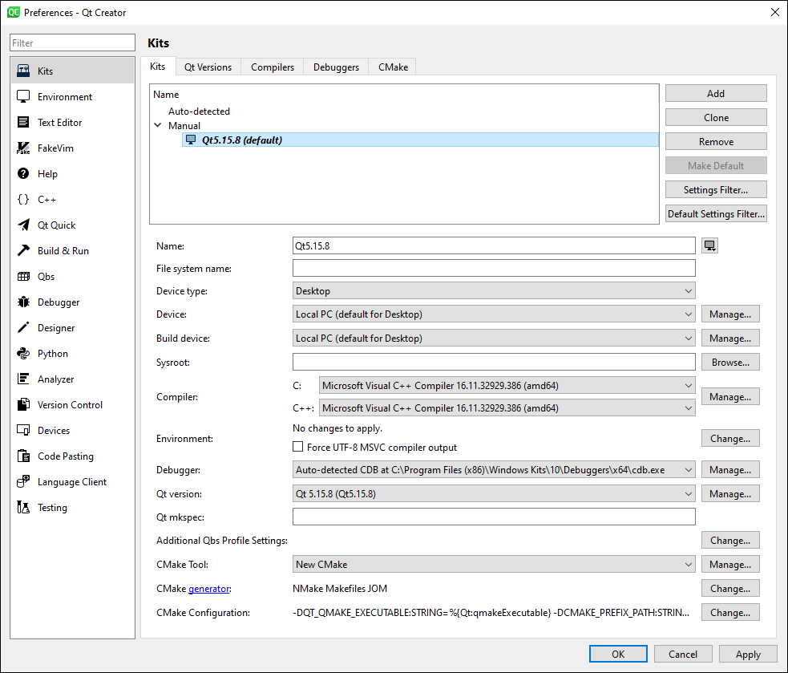
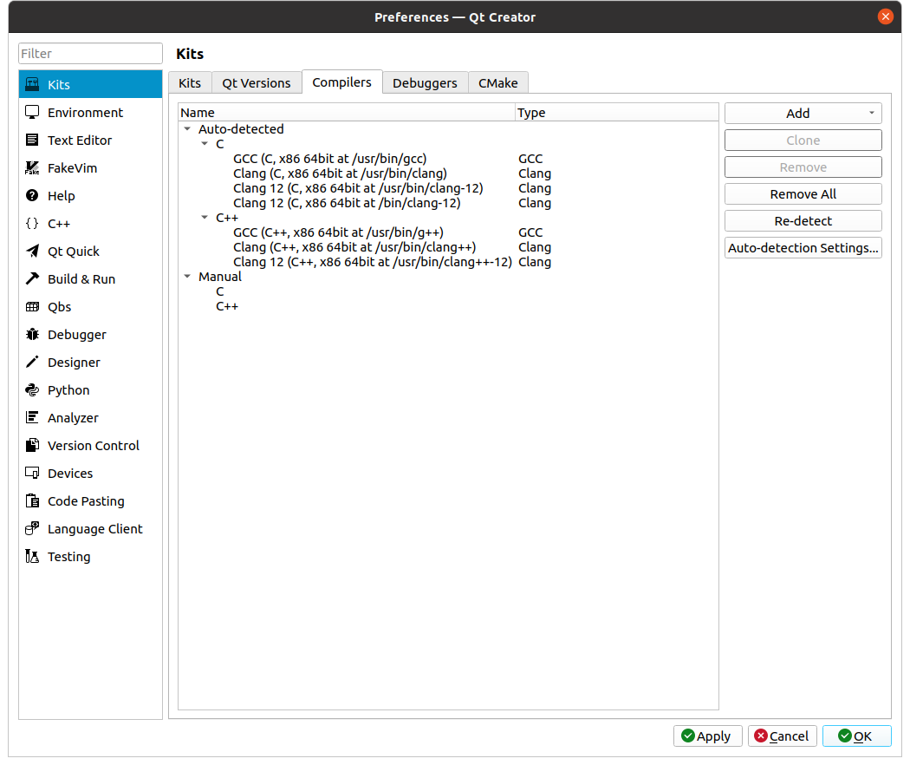
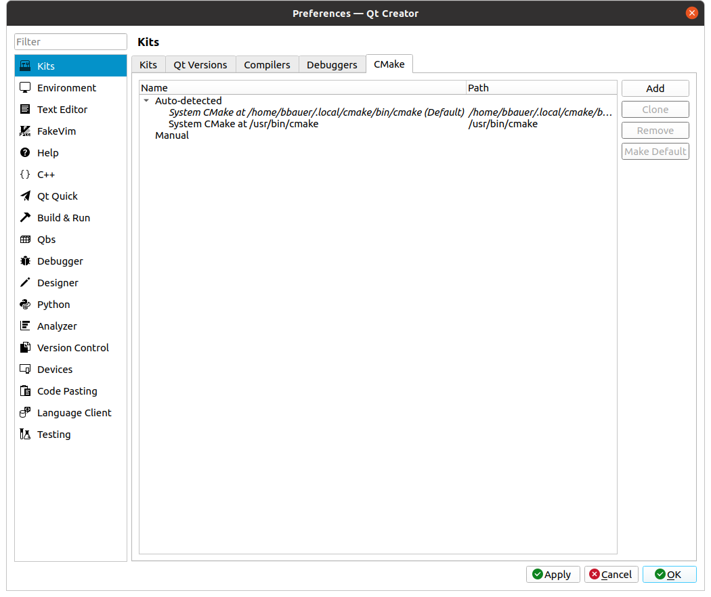
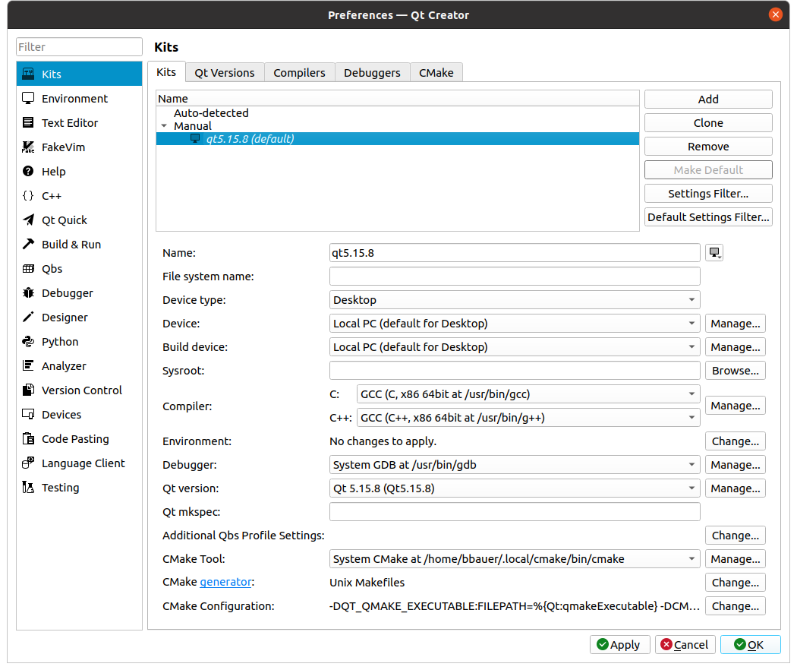

# SALSA

This README provides instructions for building the Surveyor's Applications for Least Squares Adjustment, or SALSA.

These instructions assume you have obtained the SALSA source code and extracted it to a convenient location such as `~/projects/lsa/` (Linux) or `%USERPROFILE%\projects\lsa\` (Windows).

# Development Environment Configuration

[Windows](#windows)

[Linux](#linux)

[Configuring QtCreator](#configuring-qtcreator)

## General Notes

* The following instructions will not walk the user through building debug versions for most of the dependencies. We do include instructions for building debug versions of commonly debugged dependencies (i.e. gnsstk, marble)
* The installer instructions will assume that all appropriate installer or 3rd party tar/zip files will be downloaded to `$HOME/Downloads` or `%USERPROFILE%\Downloads`. If you download them to a different directory please adjust accordingly.

## Windows

We support and test SALSA on Microsoft Windows 10 64-bit. Other configurations will probably work with minor departures from these instructions.

Note: In testing to date, many system dependencies have been installed with Administrator privileges and for all users of the system. It's likely that most or all dependencies can be installed for individual users and without Administrator privileges, but we have not explicitly tested this.

Nota Bene:
* Environment variables in Git Bash are signified with a dollar sign: e.g. `$USERPROFILE`.
* Environment variables in cmd.exe are signified by being wrapped in percent symbols: e.g. `%USERPROFILE%`
* The equivalent to `$HOME` on Linux is `%USERPROFILE%` on Windows
* In Git Bash, `/tmp/` resolves to the Windows `%TEMP%` variable
* A user's temporary directory in Windows is located at `%TEMP%` which resolves to `%USERPROFILE%\AppData\Local\Temp`
* `%USERPROFILE%` is also equivalent to `%HOMEDRIVE%%HOMEPATH%`
* In Git Bash, the `C:` drive is represented as the following path: `/c`
* Slashes as path delimiters:
  * In cmd.exe, always use backslashes for path delimiters (e.g. `msiexec /i %USERPROFILE%\Downloads\cmake-3.18.2-win64-x64.msi`)
  * In Git Bash, always use forward slashes (e.g. cd `/c/Users/johndoe/...`)
  * In passing paths to CMake, always use forward slashes regardless of cmd.exe or Git Bash (e.g. `cmake -DCMAKE_INSTALL_PREFIX=C:/Users/johndoe/.local`)

### Environment Variables

Users who wish to utilize CDash for their test suite should create an environment variable with name `LSA_CDASH_SERVER` and set it equivalent to their CDash server, e.g., `cdashserver.myorg.com`.

To use the Miniconda environment effectively, set the environment variable `CONDA_DLL_SEARCH_MODIFICATION_ENABLE` to `1`.

### Dependencies
The following sections detail how to obtain, install, and configure libraries needed to build SALSA.

#### Git

1. Download the Git application, selecting the Windows option at https://git-scm.com/downloads
1. Run the installer executable (e.g., `Git-2.24.0.2-64-bit.exe`) 
1. Select all default options when prompted

#### CMake

1. Download CMake: https://github.com/Kitware/CMake/releases/tag/v3.18.4/cmake-3.18.4-win64-x64.msi
1. Run the installer
1. Enable the following option:
   * Add CMake to the system PATH for the current user
1. For all remaining prompts, select the default option
1. Create an environment variable `CTEST_OUTPUT_ON_FAILURE` and set its value to `1`

#### BuildTools 2019

1. Download the Microsoft Visual Studio Community 2019 installer from https://visualstudio.microsoft.com/vs/older-downloads/#visual-studio-2019-and-other-products
   * This will require you to create a Visual Studio Dev Essentials account.
   * Once an account has been created, the user will be redirected to Your Subscriptions with an option to download Visual Studio 2019 Community Edition
   * After clicking to download Visual Studio Community 2019, the user will be able to install via the Visual Studio Installer
   * With the installer open, make sure that ```Desktop development with C++```->```MSVC v142 - VS 2019 C++ x64/x86 build tools``` is checked, as well as ```Windows 10 SDK```. Install.

#### Miniconda

1. Download the Miniconda3-py39_4.12.0-Windows-x86_64.exe installer executable from https://repo.anaconda.com/miniconda/

1. Run the installer, Miniconda3-py39_4.12.0-Windows-x86_64.exe
   * Choose to install for "Just Me"
   * Leave "Add Anaconda to my PATH environment variable" unchecked
   * Uncheck "Register Anaconda as my default Python 3.7" unless you desire this

1. Add the `condabin` and `Scripts` subdirectories of the installation at `C:\Users\<your username>\Miniconda3` to your `PATH` environment variable.

#### Creating the py_lsa conda environment

1. Create a `.condarc` file in your home directory (`C:\Users\YourUserName`) that points to main and free conda package channels. The main channel should come first.

   ```
   channels:
      - https://repo.anaconda.com/pkgs/main
      - https://repo.anaconda.com/pkgs/free
      - https://conda.anaconda.org/conda-forge/
   ```

1. If your home directory does not have a `pip` subdirectory, go ahead and create one. Navigate inside the `pip` subdirectory and create a `pip.ini` file with the following contents.

   ```
   [global]
   timeout = 60
   index-url = http://
   ```

1. Within the lsa root directory execute the following command to populate a python subdirectory:
   * `conda env create -f py_lsa_env.yml --prefix python`  
   If the py_lsa_win environment file is updated at some later time, the updated environment can be applied as:
   * `conda env update -f py_lsa_env.yml --prefix python`

#### QtCreator 

QtCreator is not built with the Qt sources so we must use a separate installer, and link QtCreator with the custom Qt 5.15.8 build.

1. Download the QtCreator installer from https://www.qt.io/offline-installers :

1. Install QtCreator:
    - Run `qt-creator-opensource-windows-x86_64-8.0.2.run`
    - Install with default options

1. Extend your PATH variable to include the QtCreator bin and jom directories:
   * `C:\Qt\qtcreator-8.0.2\bin`
   * `C:\Qt\qtcreator-8.0.2\bin\jom`

* Note: If the user has previous versions of Qt and/or QtCreator installed, extending the PATH variable might not work as expected. It is recommended to uninstall previous versions of Qt and/or QtCreator unless they are needed for other applications.

#### Perl

1. Download the strawberry-perl 5.32.1.1 zip from https://strawberryperl.com/releases.html
1. Unzip to your desired location
   ```
   unzip strawberry-perl-5.32.1.1-64bit.zip -d <Destination>
   ```
1. In Visual Studio 2019 (x64 Native Tools Command Prompt for VS 2019) execute the following:

   ```
    cd <strawberry-perl source directory>
    relocation.pl.bat
    update_env.pl.bat
   ```
1. Verify the install by running `where perl`

#### OpenSSL

*Note: OpenSSL 1.0.x and OpenSSL 1.1.x are NOT compatible/interchangeable. OpenSSL 1.0.x will likely be deprecated in the future.*

1. Download the Win64 OpenSSL v1.1.1t msi file from https://slproweb.com/products/Win32OpenSSL.html
1. Run the msi and accept the default installation location `C:\Program Files\OpenSSL-Win64` as well as the default options
1. The user can safely ignore the final prompt asking for a donation
  
#### Qt 5.15.8

1. Download the `qt-everywhere-opensource-src-5.15.8.zip` tarball from https://download.qt.io/official_releases/qt/5.15/5.15.8/single

1. In Git Bash unzip to the C: drive:
   `unzip qt-everywhere-opensource-src-5.15.8.zip -d C:/Qt/`

1. Copy the gnuwin32 folder to the C: drive:
    `cp -r C:/Qt/qt-everywhere-src-5.15.8/gnuwin32 C:/`

1. Extend the user's PATH variable to include the gnuwin32 bin directory:
   * `C:\gnuwin32\bin`

1. Copy the Qt patches to the Qt source code directory:  
(The following command assumes the SALSA source code is located at `$USERPROFILE/projects/lsa`; modify as necessary.)
   ```
   cp "$USERPROFILE/projects/lsa/doc/3rd_party/Qt/"*.diff C:/Qt/qt-everywhere-src-5.15.8
   ```

1. Apply the patches:
   ```
   cd C:/Qt/qt-everywhere-src-5.15.8/qtbase
   patch -p1 -i ../ARL-2023-patch.diff
   patch -p1 -i ../CVE-2022-25255-5.15.diff
   patch -p1 -i ../CVE-2022-25643-5.15.diff
   ```
1. Launch Visual Studio 2019 in a command prompt (x64 Native Tools Command Prompt for VS 2019)
   * This Command Prompt can be launched using the Windows Key->search->`2019`.  It will likely be the first result.
   * python must be discoverable from this prompt to configure and build Qt. An easy way to ensure this is to run `conda activate %USERPROFILE%\projects\lsa\python`.  

1. Build and install Qt using the VS command prompt:
   ```
   cd C:\Qt\qt-everywhere-src-5.15.8
   mkdir build
   cd build
   "..\configure" -opensource -confirm-license -openssl-runtime OPENSSL_INCDIR="C:\Program Files\OpenSSL-Win64\include" --prefix=C:\Qt\Qt5.15.8
   jom
   jom install
   ```

   * Note: The `jom` command will take a long time to complete.

1. Create a user environment variable `CMAKE_PREFIX_PATH` and set its value to `C:\Qt\Qt5.15.8`

1. Extend the user's PATH variable to include the Qt custom build bin directories:
   * `C:\Qt\Qt5.15.8\bin`

* Note: If the user has previous versions of Qt and/or QtCreator installed, extending the PATH variable might not work as expected. It is recommended to uninstall previous versions of Qt and/or QtCreator unless they are needed for other applications.

#### Configure QtCreator

1. Configure QtCreator
    - Launch QtCreator by running `qtcreator &`
    - Go to Edit->Preferences->Kits
    - Select the Qt Versions tab
        - If it did not detect the custom build of Qt, add it:
            - Select Add
            - Navigate to ``C:/Qt/Qt5.15.8/bin/qmake``
    - Select the CMake tab
        - Verify you see the user installed CMake.
    - Select the Kits tab
        - If you do not see a Qt 5.15.8 kit, add it:
            - Select Add
            - Name it Qt 5.15.8
            - Select the Qt 5.15.8 version
            - Set the CMake tool to the user installed CMake

* More detailed instructions can be found [here](#configuring-qtcreator).

* Note: On the QtCreator welcome page there will be a tab for Examples. This tab will usually be blank and not contain any examples. If the user desires to run any of the premade examples provide by Qt, simply navigate to `C:/Qt5.15.8/examples/<desired_example>` and open the corresponding .pro file.

#### texlive

##### Network Installation
1. For a network installation, go to `https://tug.org/texlive/acquire-netinstall.html` and download and run the Windows installer (`install-tl-windows.exe`), selecting Letter as the default paper size.

##### Offline Installation

  * Note: This install will take a long time to complete.

1. For an offline installation, go to `http://ctan.math.utah.edu/ctan/tex-archive/systems/texlive/Images/` and download the latest .iso file.
1. Mount the .iso file by right-clicking it and selecting `Mount`.
   * If the above doesn't work, run PowerShell as an administrator, then type `Mount-DiskImage -ImagePath "<path to iso>\texlive2022.iso"` 
1. Copy the contents of the mounted drive to a new directory on your Desktop (the installer will not run from the iso directly).
1. From PowerShell, change directories to the newly-created directory on your Desktop containing a copy of the mounted iso image, and type `.\install-tl-windows.bat`
1. An installer GUI will run.  Press the Advanced button and
   * Install for your user
   * Preferred paper size is: letter
   * Unselect "Use CTAN as a source for future packages"

#### Marble

1. Download the Marble v23.04 source code archive: https://github.com/KDE/marble/tree/release/23.04
1. Run Git Bash as an unprivileged user

1. Extract the archive to a working location (modify the following depending on your download location):
   ```
   unzip $USERPROFILE/Downloads/marble-release-23.04.zip -d $TEMP
   ```

1. Navigate to the working directory:
   ```
   cd $TEMP/marble-release-23.04
   ```

1. Copy [marble-23.04.patch](/doc/3rd_party/Marble/marble-23.04.patch) to the *marble-23.04* directory:
(The following command assumes the SALSA source code is located at `$USERPROFILE/projects/lsa`; modify as necessary.)
   ```
   cp $USERPROFILE/projects/lsa/doc/3rd_party/Marble/marble-23.04.patch .
   ```

1. Apply the patch:
   ```
   patch -p1 -i marble-23.04.patch
   ```

1. Create a build directory, and build the release version:
   ```
   mkdir build
   cd build
   cmake -DCMAKE_INSTALL_PREFIX=C:/marble -DQTONLY=TRUE -DWITH_DESIGNER_PLUGIN=ON -Wno-dev -DQT_PLUGINS_DIR=C:/Qt/Qt5.15.8/plugins -G"Visual Studio 16 2019" -A x64 -DQT_NO_DBUS=TRUE -DCMAKE_BUILD_TYPE=Release ..
   cmake --build . --config release --target install
   cd ..
   ```

1. Create a build directory, and build the debug version:
   ```
   mkdir build-debug
   cd build-debug
   cmake -DCMAKE_INSTALL_PREFIX=C:/marble_debug -DCMAKE_BUILD_TYPE=Debug -DQTONLY=TRUE -DWITH_DESIGNER_PLUGIN=ON -Wno-dev -DQT_PLUGINS_DIR=C:/Qt/Qt5.15.8/plugins -G"Visual Studio 16 2019" -A x64 -DQT_NO_DBUS=TRUE ..
   cmake --build . --config debug --target install
   cd ..
   ```

1. Create an environment variable `marble` with its value set to `C:\marble`
1. Create an environment variable `marble_debug` with its value set to `C:\marble_debug`

#### Eigen3

1. Download the Eigen 3.4.0 tarball (tar.gz) from https://github.com/eigenteam/eigen-git-mirror/releases/tag/3.4.0
1. Run Git Bash as an unprivileged user
1. Extract the following tarball to a working location:
   ```
   tar -xzvf ~/Downloads/eigen-3.4.0.tar.gz -C $TEMP
   ```

1. Navigate to the working location, create a build directory, configure, and install:
   ```
   cd $TEMP/eigen-3.4.0
   mkdir build
   cd build
   cmake -DCMAKE_INSTALL_PREFIX=$HOMEDRIVE/eigen3 -DCMAKE_BUILD_TYPE=Release ..
   cmake --build . --config release --target install
   ```

1. Create an environment variable `eigen3` and set its value to `C:\eigen3\include\eigen3`

#### QuaZip

1. Download the tar.gz file for quazip 1.4 from https://github.com/stachenov/quazip/releases/tag/v1.4
1. Run Git Bash as an unprivileged user

1. Extract the following tarball to a working location: `quazip-1.4.tar.gz`
   ```
   tar -xzvf ~/Downloads/quazip-1.4.tar.gz -C ./
   ```

1. Navigate to the root of the quazip working directory:
   ```
   cd quazip-1.4
   ```

1. Create a build directory, configure, build, and install
   ```
   mkdir build
   cd build
   cmake -G"Visual Studio 16 2019" -A x64 -DQUAZIP_BZIP2=OFF -DZLIB_ROOT=~/projects/lsa/python/Library/ -DQt5_ROOT=C:/Qt/Qt5.15.8 -DCMAKE_INSTALL_PREFIX=C:/QuaZip -DCMAKE_BUILD_TYPE=Release ..
   cmake --build . --config release --target install
   ```
   
1. If you plan on running in a debug configuration:  
   ```
   mkdir build_debug
   cd build_debug
   cmake -G"Visual Studio 16 2019" -A x64 -DQUAZIP_BZIP2=OFF -DZLIB_ROOT=~/projects/lsa/python/Library/ -DQt5_ROOT=C:/Qt/Qt5.15.8 -DCMAKE_INSTALL_PREFIX=C:/QuaZip_debug -DCMAKE_BUILD_TYPE=Debug ..
   cmake --build . --config debug --target install
   ```

#### Qwt

1. Download the Qwt 6.2.0 zip file from the following location https://sourceforge.net/projects/qwt/files/qwt/6.2.0/
1. Run Git Bash as an unprivileged user
1. Extract the following zip file to a working location: `qwt-6.2.0.zip`
   ```
   unzip $USERPROFILE/Downloads/qwt-6.2.0.zip -d $TEMP
   ```

1. In Visual Studio 2019 (x64 Native Tools Command Prompt for VS 2019) execute the following:
   ```
   cd %TEMP%\qwt-6.2.0
   mkdir build
   cd build
   C:\Qt\Qt5.15.8\bin\qmake.exe ..
   jom install
   ```
   
1. If at the end of this process, you see the follwing lines, rerun the last two commands (qmake and jom).  You should not see them the second time.
   ```
   jom: C:\Users\dtucker\Desktop\qwt-6.2.0\build\src\Makefile [debug-install] Error 2
   jom: C:\Users\dtucker\Desktop\qwt-6.2.0\build\Makefile [sub-src-install_subtargets-ordered] Error 2
   ```

1. Create an environment variable `QWT` and set its value to `C:\Qwt-6.2.0`

#### WIX

1. Download the WIX 3.10.4 installer executable from https://github.com/wixtoolset/wix3/releases/tag/wix3104rtm

1. Run the installer (wix310.exe) and choose the Install option when presented, then Exit when complete.

   
#### GNSSTk

1. Grab the tarball for version 13.8 at the following location https://github.com/SGL-UT/gnsstk/tree/v13.4.0

1. Run Git Bash as an unprivileged user

1. Extract the tarball to a working location
   ```
   unzip $USERPROFILE/Downloads/gnsstk-13.4.0.zip -d $TEMP
   ```

1. Navigate to the root of the GNSSTk directory
   ```
   cd $TEMP/gnsstk-13.4.0
   ```

1. Create a build directory, configure, build, and install
   ```
   mkdir build
   cd build
   cmake -DBUILD_EXT=TRUE -DCMAKE_INSTALL_PREFIX=$USERPROFILE/.local/gnsstk -G"Visual Studio 16 2019" -A x64 -DCMAKE_BUILD_TYPE=Release ..
   cmake --build . --config release --target install
   ```

1. Create a build directory, configure, build, and install for the debug version (optional)
   ```
   cd ..
   mkdir build-debug
   cd build-debug
   cmake -DBUILD_EXT=TRUE -DCMAKE_INSTALL_PREFIX=$USERPROFILE/.local/gnsstk_debug -G"Visual Studio 16 2019" -A x64 -DADDRESS_SANITIZER=OFF -DCMAKE_BUILD_TYPE=Debug ..
   cmake --build . --config debug --target install
   ```

### Building SALSA
Create a build directory, configure, and build. Execute the following in a windows command prompt.
```
mkdir build
cd build
cmake -Wno-dev -DCMAKE_INSTALL_PREFIX=%USERPROFILE%/.local/salsa -G"Visual Studio 16 2019" -A x64 -DCMAKE_BUILD_TYPE=Release ..
cmake --build . --config release
```

That will build the SALSA project, resulting in build products in the `build` directory. Those can be executed from that location; however some users may wish to install the SALSA suite to a more permanent location than the `build` directory. To do so, while still in the `build` directory:
```
cmake --build . --config release --target install
```

This will create a SALSA installation at `%USERPROFILE%/.local/salsa`

Whenever a warning about a missing `everyshi.sty` file appears, simply hit `enter` through the messages. The user manual will compile successfully. Next, comment out lines 807-832 and 848-849 in `CMakeLists.txt` in `~/projects/lsa`, which prevents CMake from compiling the user manual and thus encountering the build errors. Thus if the user makes any modifications to the user manual, it will need to be rebuilt using the build script `Compile.sh`. Finally, build SALSA normally and it should compile with no issues. 

Because the second option isolates the building of the user manual and requires changes to `CMakeLists.txt`, replacing the `pgfutil-latex.def` file is strongly encouraged when possible. 

1. Create the MSI:

### Creating an Installer File 
While a publically released MSI should always be available for download, users may occasionally deisre to create their own from source.

1. Ensure that the variables `LSA_BUILD_TYPE`, `LSA_MSI_TARGET`, and `LSA_PATCH_TARGET` are defined in your environment. E.g:
   `LSA_BUILD_TYPE` = `LSA`
   `LSA_MSI_TARGET` = `C:\Users\<user>`
   `LSA_PATCH_TARGET` = `C:\Users\<user>`

1. Run GitBash as an unprivilged user

1. Clean the source directory:
   ```
   cd ~/projects/lsa
   git clean -fdx
   ```

1. Re-create the python environment:
   ```
   conda env update -f py_lsa_env.yml --prefix python
   ```

1. Create the MSI:
   ```
   ctest --http1.0 -DSALSA_MP=TRUE -S scripts/BuildWin64Package.cmake -V
   ```

The MSI should now be located at the location specified by `LSA_MSI_TARGET`

## Linux

The SALSA team does most of their development on Ubuntu 20.04 Linux 64-bit. The following instructions are tailored to that distribution. Other distributions will likely work with some departures from these instructions.

### System Dependencies

We have identified the following dependencies for building the SALSA project on Ubuntu 20.04.

|*Name*|*Packages*|
|------|----------|
|TexLive| texlive texlive-base texlive-binaries texlive-extra-utils texlive-font-utils texlive-fonts-extra texlive-fonts-extra-doc texlive-fonts-recommended texlive-fonts-recommended-doc texlive-generic-extra texlive-generic-recommended texlive-latex-base texlive-latex-base-doc texlive-latex-extra texlive-latex-extra-doc texlive-latex-recommended texlive-latex-recommended-doc texlive-pictures texlive-pictures-doc texlive-pstricks texlive-pstricks-doc texlive-science texlive-science-doc |
|QuaZIP| libquazip-doc libquazip-headers libquazip5-1 libquazip5-dev libquazip5-headers |
|Mesa| mesa-common-dev libgl1-mesa-dev |
|Qt5| libnss3-dev libatspi2.0-dev flite1-dev libspeechd-dev speech-dispatcher-flite qtscript5-dev libxcb-xinerama0-dev nx-x11proto-xinerama-dev libxcb-xtest0-dev libxcb-util0-dev libxkbcommon-dev libxkbcommon-x11-dev libxcb-keysyms1-dev libxcb-image0-dev libxcb-icccm4-dev libxcb-render-util0-dev libxcb-res0-dev libasound2-dev libclang-dev libxcb-randr0-dev libxcb-shape0-dev libxcb-xfixes0-dev libxcb-sync0-dev libxcb-image0-dev libxcb-glx0-dev libx11-xcb-dev|

To see whether a package is installed:

```
dpkg --get-selections | grep <package name>
```

Note: when searching, use the package names within the *Packages* column above, rather than the possibly capitalized names in the *Names* column. It works best to search for a string that all packages have in common (e.g. `hdf5`).

To install packages:
```
sudo apt-get install <packages separated by spaces>
```

## Environment variables

Users who wish to utlize CDash for their test suite should create an environment variable with name `LSA_CDASH_SERVER` and set it equivalent to their CDash server, e.g., `cdashserver.myorg.com`. This can be achieved by adding `export LSA_CDASH_SERVER="cdashserver.myorg.com"` to `~/.profile`.

If any lines were added to `~/.profile`, source the file: `source ~/.profile`

### User-installed Dependencies

#### Miniconda

1. Check to see if you have miniconda installed:
    ```bash
    which conda 
    ```
    If that command returns a path to a conda instance, skip to the next section 'Setup the LSA Python Environment'. 

1. Run the Miniconda installer as your user:
    Download `Miniconda3-py39_4.12.0-Linux-x86_64.sh` from https://repo.continuum.io/miniconda/. Then from a terminal run the following

    ```
    chmod u+x $HOME/Downloads/Miniconda3-py39_4.12.0-Linux-x86_64.sh
    $HOME/Downloads/Miniconda3-py39_4.12.0-Linux-x86_64.sh 
    ```

    Follow all of the installer's prompts:

    1. Accept the license agreement
    1. Elect to install miniconda to the default location ($HOME/miniconda3)
    1. When prompted to prepend the miniconda3 install location to your PATH, choose *no*
        * We decline extending our PATH as the Miniconda python will take precedence over the system-installed python (in addition to xz, pip, sqlite3, and several other binaries)
        * We still have to add the following executables to our path:
            * conda
            * activate
            * deactivate
            * conda-env
    1. Instead of explicitly adding those four executables as aliases, we can create symlinks to a location that is in PATH.
        1. Create a $HOME/.local directory
        1. Add a *bin* subdirectory
            * Steps 1 and 2 can be accomplished by the following:

            ```bash
            mkdir -p $HOME/.local/bin
            ```
        1. Add the directory you just created to your PATH
            * Edit $HOME/.profile and add the following:

            ```
            if [ -d "$HOME/.local/bin" ] ; then
                PATH="$PATH:$HOME/.local/bin"
            fi
            ```

        1. Source $HOME/.profile:

            ```
            . ~/.profile
            ```        

        1. Create your symlinks:
            Since we are using relative paths, you must be in the *$HOME/.local/bin* location.
            ```bash
            cd $HOME/.local/bin
            ln -s ../../miniconda3/bin/conda .
            ln -s ../../miniconda3/bin/conda-env .
            ln -s ../../miniconda3/bin/activate .
            ln -s ../../miniconda3/bin/deactivate .
            ```

#### Setup the LSA Python Environment

1. If it doesn't already exist, create the config file `$HOME/.condarc` that points to a Miniconda package server with the free and main channels, with free before main (note: this configuation is different than the Windows configuration):

   ```
   channels:
      - https://repo.anaconda.com/pkgs/free
      - https://repo.anaconda.com/pkgs/main
      - https://conda.anaconda.org/conda-forge/
   ```

1. Run the following to create the environment. Specify a location not likely to change (e.g. `$HOME/.local/salsa_python`), as it will be used by the installed salsa binaries:

    ```bash
    cd $HOME/projects/lsa
    conda env create --prefix $HOME/.local/salsa_python -f py_lsa_env.yml
    ```

    If the py_lsa_deb environment file is updated at some later time, the updated environment can be applied as:

    ```bash
    cd $HOME/projects/lsa
    conda env update --prefix $HOME/.local/salsa_python -f py_lsa_env.yml
    ```

    Add the following line to `~/.profile` to tell the salsa binaries where your salsa python conda environment interpreter is. E.g.:

    ```bash
    export SALSA_PYTHON_EXE=$HOME/.local/salsa_python/bin/python
    ```

    Remove `libffi.7.so` and `libffi.so.7`:

    ```bash
    rm $HOME/.local/salsa_python/lib/libffi.7.so $HOME/.local/salsa_python/lib/libffi.so.7
    ```

    Then source the `~/.profile` file: `source ~/.profile`.

    You should now have a LSA python environment created in a stable location.

#### CMake 3.18.4

1. Download the CMake 3.18.4 tar.gz file: https://github.com/Kitware/CMake/releases/tag/v3.18.4/cmake-3.18.4.tar.gz

1. Extract the CMake source tarball to a working directory:

   ```
   tar -xzvf $HOME/Downloads/cmake-3.18.4.tar.gz -C /tmp
   ```

1. Create a build directory and *cd* into it:

   ```
   mkdir /tmp/cmake-3.18.4/build
   cd /tmp/cmake-3.18.4/build
   ```

1. Run *configure*:
   ```
   ../configure --prefix=$HOME/.local/cmake
   ```

1. Build and install:

   ```
   make -j4
   make install -j4
   ```

1. Add the following line to `~/.profile` (unless it is already present):

   ```
   export PATH=$HOME/.local/cmake/bin:$PATH
   ```  
   
   Which can be done manually by opening and editing `~/.profile` in a text editor, or via the command:
   ```
   echo export PATH='$HOME'/.local/cmake/bin:'$PATH' >> $HOME/.profile
   ```

1. Add the following line to `~/.profile` (unless it is already present):

   ```
   export CTEST_OUTPUT_ON_FAILURE=1
   ```
   
   Which can be done manually by opening and editing `~/.profile` in a text editor or via the command:
   ```
   echo export CTEST_OUTPUT_ON_FAILURE=1 >> $HOME/.profile
   ```

1. Create the file `$HOME/.bash_profile` if it does not exist, and add the following lines (if they are not already in place):

    ```
    if [ -r ~/.profile ]; then . ~/.profile; fi
    if [ -r ~/.bashrc ]; then . ~/.bashrc; fi
    ```

    where `-r ~.profile` and `-r ~.bashrc` are true if those files have read permission (https://www.tldp.org/LDP/abs/html/fto.html), and `. ~/.profile` and `. ~/.bashrc` source those files.

1. Source the `.bash_profile` file

   ```
   source $HOME/.bash_profile
   ```

1. CD out of CMake working directory and then remove it:

   ```
   cd
   rm -r /tmp/cmake-3.18.4
   ```

1. Verify the proper version (3.18.4) of cmake was installed via

   ```
   cmake --version
   ```

#### Qt 5.15.8

1. Download the `qt-everywhere-opensource-src-5.15.8.tar.xz` zip from https://download.qt.io/official_releases/qt/5.15/5.15.8/single

1. Extract the file to `~/`:

   ```
   tar -xf qt-everywhere-opensource-src-5.15.8.tar.xz -C ~/
   ```
1. Copy the Qt patches to the Qt source code directory:  
(The following command assumes the SALSA source code is located at `$HOME/projects/lsa`; modify as necessary.)
   ```
   cp $HOME/projects/lsa/doc/3rd_party/Qt/*.diff ~/qt-everywhere-src-5.15.8
   ```

1. Apply the patches:
   ```
   cd ~/qt-everywhere-src-5.15.8/qtbase
   patch -p1 -i ../ARL-2023-patch.diff
   patch -p1 -i ../CVE-2022-25255-5.15.diff
   patch -p1 -i ../CVE-2022-25643-5.15.diff
   ```

1. Build and install Qt:
   ```
   cd ~/qt-everywhere-src-5.15.8/
   mkdir build
   cd build
   ../configure -opensource -confirm-license -prefix ~/Qt5.15.8
   make -j8
   make -j8 install
   ```
   
1. Verify the following exist in `~/.profile`:
   ```
   export PATH=$HOME/Qt5.15.8/bin:$PATH 
   export CMAKE_PREFIX_PATH=$HOME/Qt5.15.8
   export QT_QPA_PLATFORM_PLUGIN=$HOME/Qt5.15.8/plugins/platforms 
   ```
   If they are not present add them via the following command(s):
   ```
   echo export PATH=$HOME/Qt5.15.8/bin:$PATH >> $HOME/.profile
   echo export CMAKE_PREFIX_PATH=$HOME/Qt5.15.8 >> $HOME/.profile
   echo export QT_QPA_PLATFORM_PLUGIN=$HOME/Qt5.15.8/plugins/platforms >> $HOME/.profile
   ```

1. (Optional) Delete the source code:
   ```
   cd ~/
   rm -r qt-everywhere-src-5.15.8/
   ```

#### QtCreator
   
QtCreator is not built with the Qt sources so we must use a separate installer, and link QtCreator with the custom Qt 5.15.8 build.

1. Download the QtCreator installer from https://www.qt.io/offline-installers :

1. Install QtCreator:
    - Run `qt-creator-opensource-linux-x86_64-8.0.1.run`
    - Install with default options
1.  Verify .profile has this line in it:
    - `export PATH=$HOME/qtcreator-8.0.1/bin:$PATH`
    - If not, add it:
    - `echo export PATH=$HOME/qtcreator-8.0.1/bin:$PATH >> $HOME/.profile`
1. Source your .bash_profile
    * `source $HOME/.bash_profile`
1. Configure QtCreator
    - Add `alias qtcreator='$HOME/qtcreator-8.0.1/bin/qtcreator'` to your `~/.bashrc`, then source
    - Launch QtCreator by running `qtcreator &`
    - Go to Edit->Preferences->Kits
    - Select the Qt Versions tab
        - If it did not detect the custom build of Qt, add it:
            - Select Add
            - Navigate to ``$HOME/Qt5.15.8/bin/qmake``
    - Select the CMake tab
        - Verify you see the user installed CMake.
    - Select the Kits tab
        - If you do not see a Qt 5.15.8 kit, add it:
            - Select Add
            - Name it Qt 5.15.8
            - Select the Qt 5.15.8 version
            - Set the CMake tool to the user installed CMake
            
* More detailed instructions can be found [here](#configuring-qtcreator).

* Note: On the QtCreator welcome page there will be a tab for Examples. This tab will usually be blank and not contain any examples. If the user desires to run any of the premade examples provide by Qt, simply navigate to `~/Qt5.15.8/examples/<desired_example>` and open the corresponding .pro file.

#### Marble

1. Download the Marble v23.04 source code archive: https://invent.kde.org/education/marble/-/tree/release/23.04 and clicking the `Download` link and selecting `.zip` 

   
1. Extract the Marble archive to a working location:

   ```
   unzip $HOME/Downloads/marble-release-23.04.zip -d /tmp
   ```

1. Navigate to the directory that was just extracted:

   ```
   cd /tmp/marble-release-23.04
   ```

1. Copy [marble-23.04.patch](/lsa/doc/3rd_party/Marble/marble-23.04.patch) to the *marble-release-23.04* directory:

   ```
   cp $HOME/projects/lsa/doc/3rd_party/Marble/marble-23.04.patch .
   ```
   Modify the command as appropriate depending on the location of your SALSA source archive.

1. Apply the patch:

   ```
   patch -p1 -i marble-23.04.patch
   ```

1. Create the build directory, configure, build, and install:

   ```
   mkdir build
   cd build
   cmake -DCMAKE_INSTALL_PREFIX=$HOME/.local/marble -DCMAKE_BUILD_TYPE=Release -DQTONLY=TRUE -DWITH_DESIGNER_PLUGIN=ON -DQT_PLUGINS_DIR=$HOME/Qt5.15.8/plugins -Wno-dev -DQT_NO_DBUS=TRUE ..
   make -j4
   make install -j4
   ```

1. (Optional) Install marble debug:

   ```
   cd ../
   rm -r build
   mkdir build
   cd build
   cmake -DCMAKE_INSTALL_PREFIX=$HOME/.local/marble_debug -DCMAKE_BUILD_TYPE=Debug -DQTONLY=TRUE -DWITH_DESIGNER_PLUGIN=ON -DQT_PLUGINS_DIR=$HOME/Qt5.15.8/plugins -Wno-dev -DQT_NO_DBUS=TRUE ..
   make -j4
   make install -j4
   ```

#### Qwt

1. Download the qwt-6.2.0 zip file from https://sourceforge.net/projects/qwt/files/qwt/6.2.0/

1. Extract the Qwt archive to a working location:

   ```
   unzip $HOME/Downloads/qwt-6.2.0.zip -d /tmp
   ```

1. Navigate to the directory that was just extracted:

   ```
   cd /tmp/qwt-6.2.0
   ```

1. Update `qwtconfig.pri` to change `QWT_INSTALL_PREFIX` and `QWT_INSTALL_PLUGINS`:

   ```
   sed -i 's/QWT_INSTALL_PREFIX    = \/usr\/local/QWT_INSTALL_PREFIX    = $$(HOME)\/.local/g' qwtconfig.pri
   sed -i 's/QWT_INSTALL_PLUGINS   = $${QWT_INSTALL_PREFIX}/QWT_INSTALL_PLUGINS   = $$(HOME)\/qtcreator-8.0.1\/lib\/Qt/g' qwtconfig.pri
   ```

   The first sed command replaces `QWT_INSTALL_PREFIX    = \/usr\/local` with `QWT_INSTALL_PREFIX    = $$(HOME)\/.local` (using the g flag to ensure case conversion does not propagate from one occurrence of the regular expression to another).
   
   The second sed command replaces `QWT_INSTALL_PLUGINS   = $${QWT_INSTALL_PREFIX}` with `QWT_INSTALL_PLUGINS   = $$(HOME)\/qtcreator-8.0.1\/lib\/Qt/g`.

1. Create a build directory, configure, compile, and install

   ```
   mkdir build
   cd build
   $HOME/Qt5.15.8/bin/qmake ..
   make -j4
   make install -j4
   ```

#### Eigen3

1. Download the Eigen 3.4.0 tarball from https://github.com/eigenteam/eigen-git-mirror/releases/tag/3.4.0

1. Extract the Eigen3 tarball to a working location:

   ```
   tar -xzvf ~/Downloads/eigen-3.4.0.tar.gz -C /tmp/
   ```

1. Navigate to the directory that was extracted:

   ```
   cd /tmp/eigen-3.4.0
   ```

1. Create a build directory, configure, and install:

   ```
   mkdir build
   cd build
   cmake -DCMAKE_INSTALL_PREFIX=$HOME/.local/eigen3 ..
   make install
   ```

#### GNSSTk

1. Grab the zip for version 13.4 at the following location https://github.com/SGL-UT/gnsstk/tree/v13.4.0

1. Extract the tarball to a working location

   ```
   unzip $HOME/Downloads/gnsstk-13.4.0.zip -d /tmp/
   ```

1. Run the build script to compile and install the toolkit:

   ```
   cd /tmp/gnsstk-13.4.0
   ./build.sh -eux -i $HOME/.local/gnsstk -- -DCMAKE_BUILD_TYPE=release
   ```

1. (Optional) Run the build script to compile and install the debug version of the toolkit:

   ```
   ./build.sh -euxn -i $HOME/.local/gnsstk_debug -- -DCMAKE_BUILD_TYPE=debug
   ```

### SALSA

1. Create a build directory, configure, and build. NOTE: You must NOT be in the py_lsa conda environment or this will not work (cmake points to the h5py directory instead of the desired hdf5 library directory).:

   ```
   cd $HOME/projects/lsa
   mkdir build
   cd build
   cmake -DCMAKE_INSTALL_PREFIX=$HOME/.local/salsa ..
   make -j4
   cd ..
   ```

That will build the SALSA project, resulting in build products in the `build` directory. Those can be executed from that location; however some users may wish to install the SALSA suite to a more permanent location than the `build` directory:

```
cd $HOME/projects/lsa/build
make install
```

This will create a SALSA installation at `$HOME/.local/salsa`

1. Create a build directory, configure, and build the debug version:

   ```
   cd $HOME/projects/lsa
   mkdir build_debug
   cd build_debug
   cmake -DCMAKE_BUILD_TYPE=Debug ..
   make -j4
   cd ..
   ```
   
(We do not recommend `make install` for the debug version.)

## Verify Successful SALSA Build

Below are instructions for launching SALSA and running one of the included examples. Refer to the User Manual for a complete treatment of Example 2; here we simply execute the project as a quick test that SALSA components are present and function together.
   * Copy the `examples/example02` directory from the SALSA source directory to a convenient location such as your Desktop.
   * Windows:
      * Use File Explorer to navigate to the SALSA `build` directory you created earlier, or if you *installed* SALSA using `install` in the build command, navigate to that location, e.g., `.local\salsa\bin` in your home (`%USERPROFILE%`) directory.
      * Launch SALSA by double-clicking `salsa.exe`
   * Linux:
      * If you *installed* SALSA using `install` in the build command:
         * Launch a command prompt and `cd` to the installation location, e.g., `~/.local/salsa/bin`.
         * Launch SALSA via `./salsa &`
      * If you just built SALSA without installing:
         * Launch a command prompt and `cd` to the SALSA `build` directory you created earlier
         * Launch SALSA via `./salsa &`
   * Observe the UI launch
   * Project --> Open SALSA Project
   * Select `redundancy.proj` from the `example02` directory that you copied
      * Observe several UI panels are populated including the map which shows the Initial project state
   * Execute the adjustment: Project --> Calculate Adjustment
      * After several seconds, observe output tables are populated and map now shows the Adjusted state
   * Enable the Map Layer by checking the corresponding check box
      * Observe that you can zoom in and out and, if you have Internet access, observe the rendered map layer

## Troubleshooting SALSA Builds

If SALSA does not successfully build, try the following:

1. Fully delete any existing build directories and recreate them
1. Log out and log back in, or reboot machine - this can be necessary if links to previous installations of Qt (or other products) are still in place. This will reset your path to the correct values based on those you've specified.

## Configuring QtCreator

To get QtCreator to a fresh starting place, free from pollution from prior installations and prior builds:

1. Remove contents of projects' build directories, and delete the lsa/CMakeLists.txt.*user file, if any.
2. On Windows, go to `C:\Users\UserName\AppData\Local` and `C:\Users\UserName\AppData\Roaming` and delete the QtProject folders.

### Windows

1. From a GitBash window, type `qtcreator &`
1. Select Help->About Plugins... from the QtCreator menu
1. Scroll down to Core and uncheck the Welcome subitem
1. Click the Close button
1. Open the Edit > Preferences... menu item
1. Click on *Kits* in the lefthand sidebar
1. Click on the *Compilers* tab on top
1. Remove all compilers under the *Manual* tree
1. Click on the *Kits* tab on top
1. Click on the *Qt 5.15.8* kit
1. Specify the appropriate compilers
   * `Microsoft Visual C++ Compiler 16.11.32929.386 (amd64)` on Windows
1. Ensure that the CMake generator is `NMake Makefiles JOM` for Windows
1. Click on *Apply* to save changes

    

1. Click on *Build & Run* in the lefthand sidebar
1. Click on the *Default Build Properties* tab on top
1. Edit the *Default build directory* field to read: `build-%{CurrentBuild:Name}`
1. Click on *Apply* to save the changes
1. Click on *Debugger* in the lefthand sidebar
1. Click on the *CDB* tab.
1. Uncheck the *Use Python dumper* subitem
1. Click on the *Apply* button to save the changes
1. Click on the *Locals & Expressions* tab
1. In the *Extra Debugging Helpers* text box type `C:/Users/username/projects/lsa/scripts/debugVisualizer.py`
1. Click on *OK* to save changes and to close the dialog
1. Deselect all imported kits and only enable the Qt 5.15.8 kit
1. Expand the details for the Qt 5.15.8 kit and deselect all configurations except for *Debug* and *Release*
1. Click the *Configure Project* button to apply changes

### Linux

1. Before launching QtCreator from the gnome interface, you will need to log out and back into gnome in order for your changes to .profile to take effect.
1. Open the Edit > Preferences... menu item
1. Click on the *Kits* tab on the left
1. Click on the *Compilers* tab on top
1. Remove all compilers under the *Manual* tree
   
1. Click on the *CMake* tab on top
1. If the *Auto-detected* CMake options does not include the one under $HOME/.local/cmake, go ahead and add it
       
1. Click on the *Kits* tab on top
1. Click on the *Qt 5.15.8* kit
1. Specify the appropriate *CMake Tool*
   * Version 3.8.2 installed to your `$HOME/.local/cmake` folder: `System CMake at /home/[user name]/.local/cmake/bin/cmake`
1. Specify the appropriate compilers
   * C: `GCC (C, x86 64bit in /usr/bin)` and C++: `GCC (x86 64bit in /usr/bin)` on Linux
1. Click on *Apply* to save changes
   
1. Click on the *Build & Run* tab on the left
1. Click on the *Default Build Properties* tab on top
1. Edit the *Default build directory* field to read: `build-%{CurrentBuild:Name}`
1. Click on the *Apply* button to save the changes
1. Click on *Debugger* in the lefthand sidebar
1. Click on the *Locals & Expressions* tab
1. In the *Extra Debugging Helpers* text box type `/home/username/projects/lsa/scripts/debugVisualizer.py`
1. Click on *OK* to save changes and to close the dialog
1. Open up a project
1. Deselect all imported kits and only enable the Qt 5.15.8 kit
1. Expand the details for the Qt 5.15.8 kit and deselect all configurations except for *Debug* and *Release*
1. Click the *Configure Project* button to apply changes
1. Click on the *Projects* button on the left
1. Modify the *Build Steps* section for both *Debug* and *Release*
   1. Click on the **x** on the `cmake --build . --target all` command to delete it
   1. Click on *Add Build Step* then *Custom Process Step*
   1. Enter `make` for the Command
   1. Enter `-j4` for the Arguments
   1. Repeat for the other build configuration (Release or Debug)

## Automated Testing

*At time of writing (December 2019) we have several hundred test cases in our internal SALSA repository, but many of these contain data that may not be appropriate for public release; therefore we have only trivial test coverage included in the public source distribution. We will contribute test cases to the public distribution as soon as feasible, because we judge automated testing to be important to maintaining quality code.*

Note: On Windows, you must specify a build configuration when running ctest: e.g. `ctest -C release`

* To run automated tests from inside a build directory
  * First, ensure that the SALSA python environment is activated
  * Run all tests: `ctest`
  * Run all tests with 'gui' in the name: `ctest -R gui`
  * Run all tests except those with 'gui' in the name: `ctest -RE gui`
  * Run all tests except those labeled as LONG: `ctest -LE LONG`
* See the cmake/ctest docs for more details: `https://cmake.org/Wiki/CMake/Testing_With_CTest#Running_Individual_Tests`

## Cleaning up QtCreator Configuration after migrating to a newer version

QtCreator will attempt to import the configuration from projects that have been opened in an older version of QtCreator. **Do not import the older configuration.** If you have already imported the old configuration, perform the following actions:
1. Open the Edit > Preferences... menu item
1. Click on *Kits* on the left
1. Click on *Compilers* on top
1. Remove all compilers under the *Manual* tree
1. Click on the *Kits* tab on top
1. Select the *Qt 5.15.8* kit
1. Ensure that the compilers are populated and correspond to the configuration detailed in the [Configuring QtCreator](#configuring-qtcreator) section.

